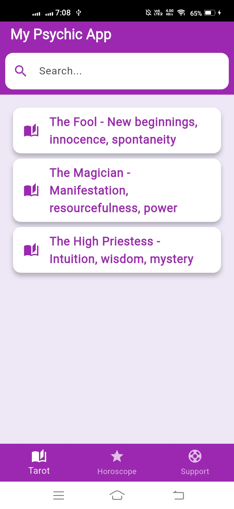
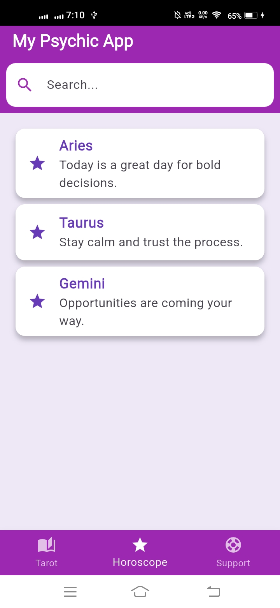
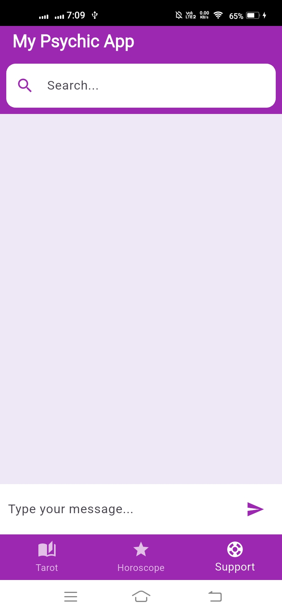
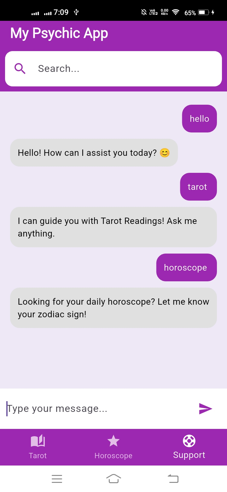

# 🔮 Psychic App

## 🌟 Overview
**Psychic App** is a **Flutter-based mobile application** that offers spiritual guidance through **Tarot Readings, Daily Horoscopes, and Customer Support**. The app provides a seamless user experience with an intuitive interface, personalized astrology updates, and easy navigation.

---

## 📸 Screenshots
| Home Screen | Tarot Reading | Horoscope | Support |
|------------|--------------|-----------|---------|
|  |  |  |  |

---

## 🚀 Features
✅ **🃏 Tarot Readings** - Get insights through virtual tarot cards.  
✅ **🔥 Daily Horoscopes** - Personalized astrology predictions.  
✅ **📞 Customer Support** - Easily contact spiritual advisors.  
✅ **🔍 Search & Navigation** - Quick access to key features.  
✅ **📲 Intuitive UI** - A sleek, user-friendly design.  

---

## 📲 Installation
### Prerequisites
Ensure you have the following installed:
- **Flutter SDK** (latest version) ➜ [Install Flutter](https://flutter.dev/docs/get-started/install)
- **Android Studio / VS Code** (for development)
- **A Device Emulator or Physical Device**

### Clone the Repository
```sh
git clone https://github.com/yourusername/psychic-app.git
cd psychic-app
```

### Install Dependencies
```sh
flutter pub get
```

### Run the App
```sh
flutter run
```

## ⚙️ Tech Stack
- **Flutter & Dart** - Frontend Development
- **Firebase** - Backend & Authentication (You can Use)
- **Cloud Firestore** - Database (You can Use)
- **Provider** - State Management (You can Use)

---

## Support
For any issues or feature requests, feel free to open an [Issue](https://github.com/yourusername/psychic-app/issues) or reach out to us.

---

🔮 *Unlock the future with the Psychic App!* 🌟
